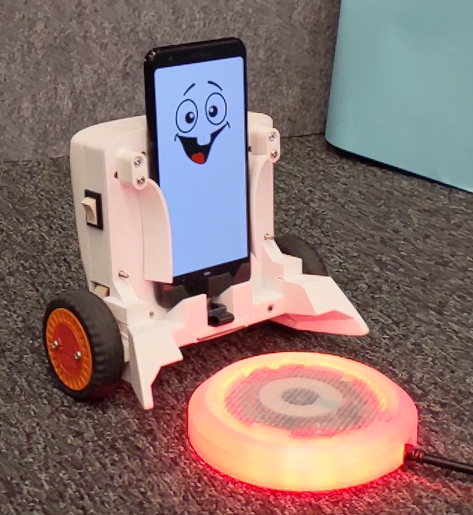
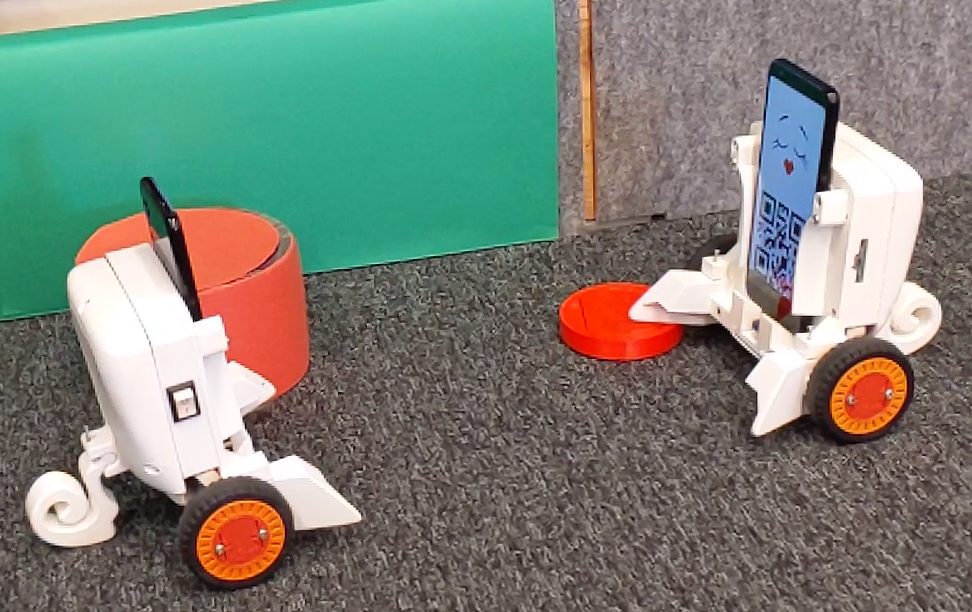

# OIST Smartphone Robotics Platform
Smartphone robot project of Neural Computation Unit at OIST. 

# Introduction

Recent smartphones are loaded with almost everything we need for a robot, including a high-performance, energy-efficient CPU, cameras, gyros, accelerometers, GPS, wireless communication and open-source software developing environment. Meanwhile hardware compatible microcontroller chips like Arduino, Raspberry Pi, and IOIO have become popular and handy. By integrating a smartphone and actuators, this project aims to develop a low-cost and high-performance robotic platform for desktop educational robots and multi-agent research. 

We developed a two wheeled balancer robot as a single agent to achieve various basic behaviors such as balancing, standing-up and balancing, and approaching visual target while balancing using the smartphone's internal accelerometer, gyroscope and camera in addition to the wheel's rotary encoders. The agent is used for testing and developing motor control algorithms under the domain of control theory and reinforcement learning. 

More advanced single agent behaviors are under construction, including navigation, collision avoidance, objective tracking, homing, foraging, etc. The overall purpose of this project is to build up an evolutionary sustainable smartphone robot colony, in which all the individuals are able to achieve self-preservation and self-reproduction behaviors to help us understand animal and human minds.

# Further Details

For further details and user guide, please see the [wiki](https://github.com/oist/smartphone-robot/wiki)

# Attribution
Facial expression artwork:
<a href="https://www.vecteezy.com/free-vector/cartoon-eyes">Cartoon Eyes Vectors by Vecteezy</a>